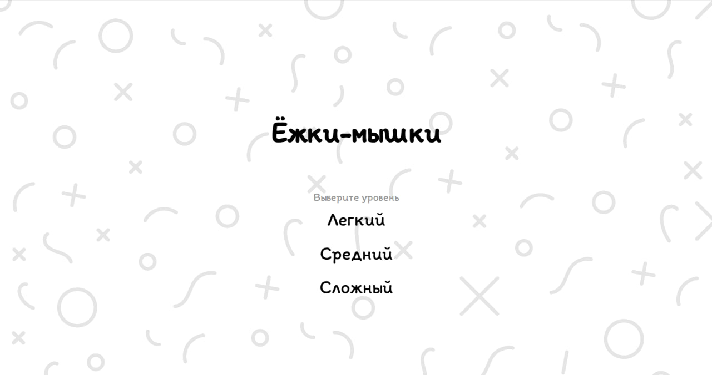
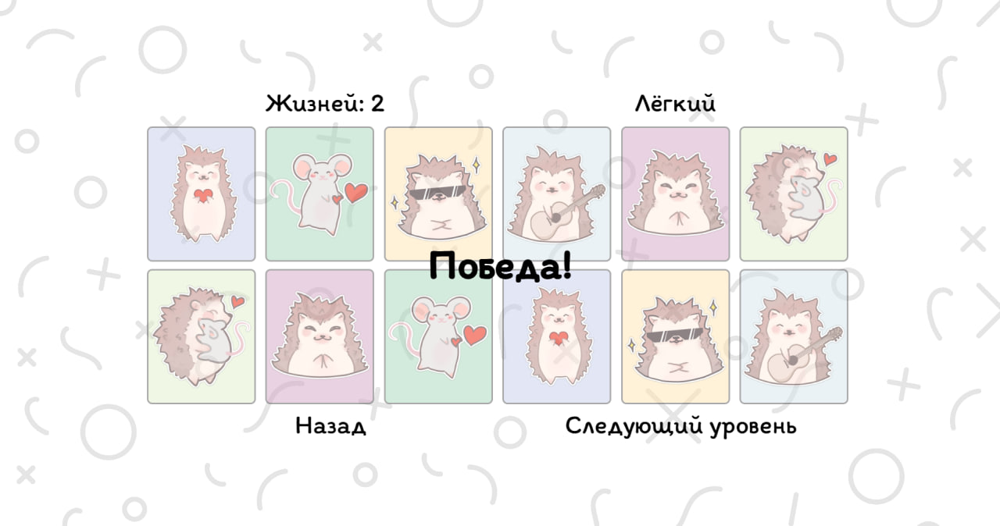
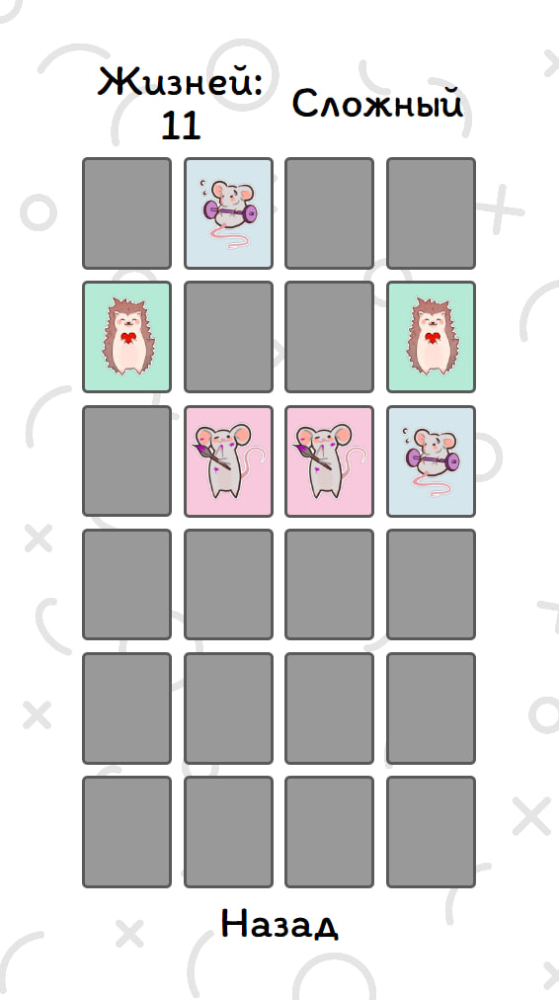

# 🧠 Memory Cards Game

Интерактивная игра на запоминание, где игроку нужно находить пары одинаковых карточек. Разработана с анимацией, адаптивной версткой и прогрессивными уровнями сложности.

## 🚀 Функциональность

- Адаптивное отображение для любого экрана
- 3 уровня сложности: 12, 18 и 24 карточки  
- Ограниченное количество жизней на уровне  
- Анимация переворота карточек  
- Плавные переходы между экранами  
- Победа и поражение с возможностью переиграть уровень или перейти на следующий  
- Случайная генерация карточек и цветов при каждой игре

## 🛠️ Технологии

- HTML + CSS  
- Vanilla JavaScript  
 
## 📸 Скриншоты

  
  
  

## 💾 Установка и запуск

1. Склонировать или скачать репозиторий  
2. Открыть `index.html` в браузере  
3. Начать с лёгкого уровня и пройти все 3 уровня подряд!
